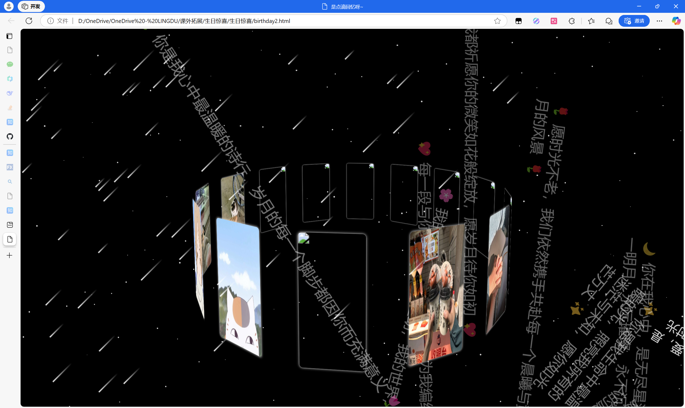
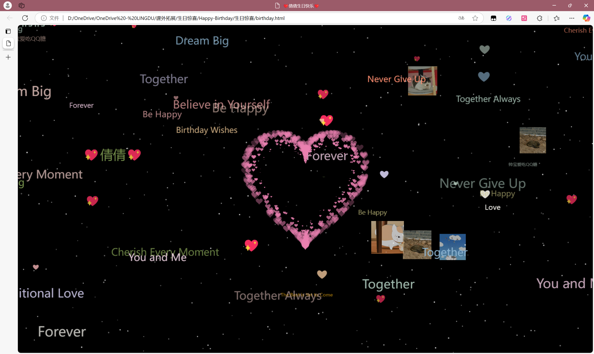
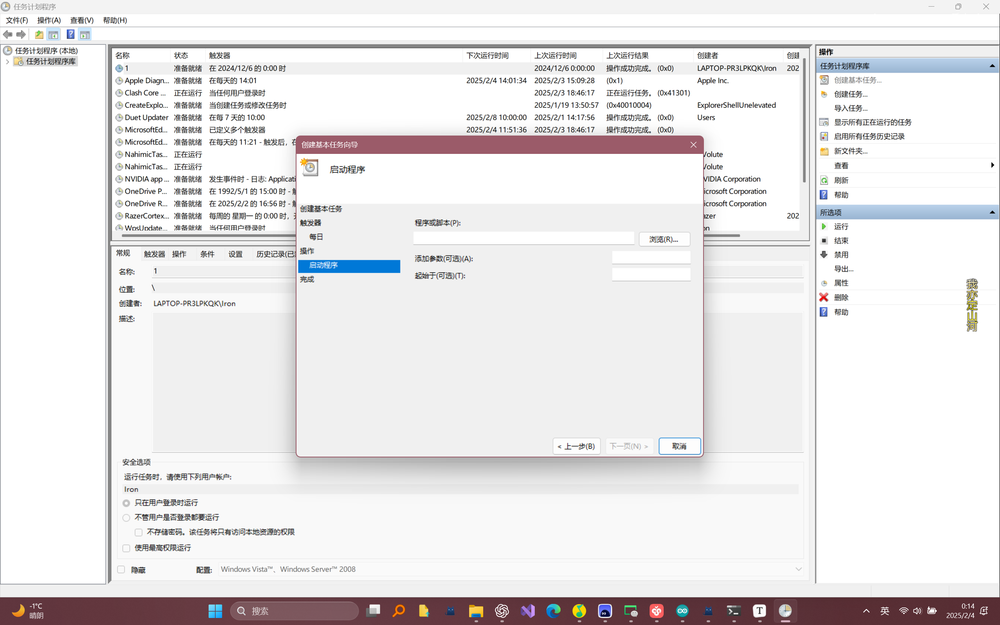

# Happy-Birthday
之前女朋友过生日，整合的一个惊喜（究极缝合怪）
# 介绍
1. birthday2.html是入口网页

   

+ 背景流星

+ 3D照片墙

+ 流言飞爱语
2. birthday.html是上一个网页跳转后的
	 
+ 中间樱花跳动爱心
+ 飘舞爱心和文章
+ 修猫照片飘舞
+ 背景点点星空

# 食用指南
1. birthday2.html

``` javascript
  <h1>生日快乐！</h1>
    <p>祝你每一天都充满快乐与幸福。</p>
    <p>希望今天能给你带来一个特别的惊喜！</p>
    <div class="perspective">
        <div class="wrap" id="imgwrap">
            
            
            
            
            
            
            
            
            
            
            
            
            
            
        </div>

        <div id="heartText" class="heart">
            ❤️ 爱，是跨越时光的诗篇；与你共度，是我一生的温柔与期待 ❤️
        </div>
        <div id="text1" class="text">
            💖 每一段与你的相遇，仿佛是宇宙为我编织的诗行，悄然诉说着永恒的爱意 💖
        </div>
        <div id="text2" class="text">
            💫 生日，是你生命中的一颗璀璨星辰，愿它引领你走向更加辉煌的未来 💫
        </div>
        <div id="text3" class="text">
            🌸 我的心，因你而生动；我的世界，因你而诗意盎然 🌸
        </div>
        <div id="text4" class="text">
            🌹 愿时光不老，我们依然携手共赴每一个晨曦与黄昏，踏过每一段岁月的风景 🌹
        </div>
        <div id="text5" class="text">
            ✨ 你是我生命中最温暖的光，照亮我所有的迷茫与未知，愿你如光芒万丈 ✨
        </div>
        <div id="text6" class="text">
            🌙 你在我心中，是无尽星河里的唯一明月，永远璀璨，永不沉寂 🌙
        </div>
        <div id="text7" class="text">
            💖 每个清晨，我都祈愿你的微笑如花般绽放，愿岁月待你如初 💖
        </div>
        <div id="text8" class="text">
            🌟 生日是你心灵的华章，愿它以你为主旋律，奏响每一个动人的旋律 🌟
        </div>
        <div id="text9" class="text">
            🌷 你是我心中最温暖的诗行，岁月的每一个脚步都因你而充满意义 🌷
        </div>

    </div>
    
```

   - 祝福语自定义
   - 将照片拉进这个文件夹中替换文件

2.  birthday.html
	
``` javascript
// 猫咪图片数组
        const catImages = ['https://th.bing.com/th/id/OIP.i6W2axiissMTHlP1wNku-wHaJk?w=147&h=190&c=7&r=0&o=5&dpr=2.5&pid=1.7'];

        // 假设文件夹中的图片命名从 11.jpg 到 36.jpg
        for (let i = 11; i <= 36; i++) {
            catImages.push(`./${i}.jpg`);  // 假设图片和当前HTML文件在同一目录下
            
```
- 猫猫图片可以去网上自己找个链接替换
- 将文件夹中11-36照片替换，也可以添加37、38~~~

``` javascript

// 文字数组
        const messages = [
            "Love",
            "💖倩倩💖",
            "Forever",
            "Together",
            "Happiness",
            "💖",
            "You and Me",
            "Be Happy",
            "Never Give Up",
            "Dream Big",
            "💖",
            "💖",
            "❤",
            "❤",
            "❤",
            "❤",
            "❤",
            "❤",
            "❤",
            "❤",
            "❤",
            "Believe in Yourself",
            "Birthday Wishes",
            "May All Your Dreams Come True",
            "Cherish Every Moment",
            "The Best is Yet to Come",
            "You're My Everything",
            "Endless Love",
            "Together Always",
            "Unconditional Love",
            "帅宝爱吃QQ糖"
        ];
            
```
- 漂浮的爱心和文字可以改变。
3. open_birthday .bat
- 这个是用来制造惊喜的，可以结合电脑的任务计划，让他准时在00:00点播放
	- 操作选择启动程序，然后选择这个脚本。
	
	tips：
- 最好联系她的舍友，帮忙开远程桌面进行操作。（加油哦~🫡）
